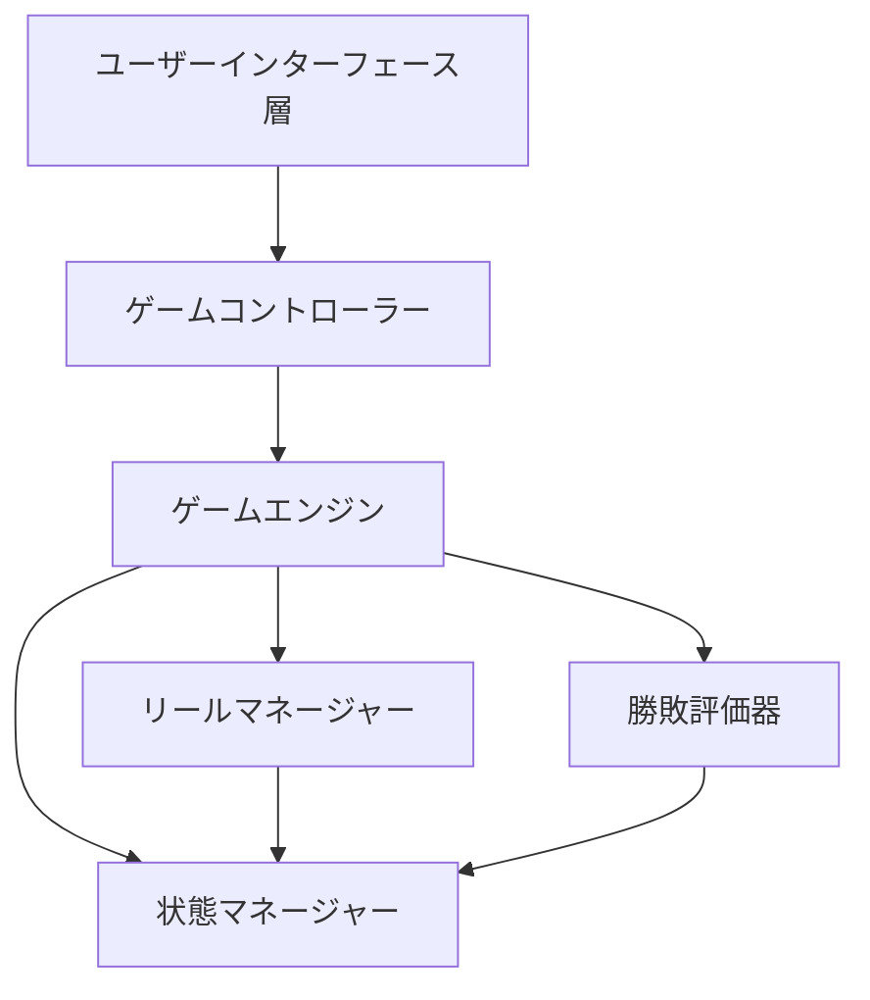

# 設計ドキュメント: スロットマシンアプリ

## 概要

本ドキュメントは、魅力的なギャンブルゲーム体験を提供するシンプルなスロットマシンアプリケーションの設計を概説します。本システムは、ランダムシンボル生成、勝敗判定、直感的なユーザーインターフェースを備えた3リールスロットマシンを実装します。

設計は、ゲームロジック、ユーザーインターフェース、アプリケーション制御の間で明確な関心の分離を確保するために、Model-View-Controller（MVC）アーキテクチャパターンに従います。システムは、将来の拡張に対する拡張性を維持しながら、シンプルさを重視しています。

## アーキテクチャ

### ハイレベルアーキテクチャ



### アーキテクチャ層

1. **ユーザーインターフェース層**: すべての視覚要素とユーザーインタラクションを処理
2. **ゲームコントローラー**: ゲームフローを統括し、UIとゲームエンジン間を調整
3. **ゲームエンジン**: スピン機構と結果処理を含むコアゲームロジック
4. **コンポーネント層**: リール、勝敗評価、状態管理のための専門コンポーネント

## コンポーネントとインターフェース

### GameEngineインターフェース

コアゲームエンジンはスロットマシン全体の機能を管理します：

```typescript
interface GameEngine {
  // ゲーム状態管理
  getCurrentState(): GameState
  canSpin(): boolean

  // スピン操作
  initiateSpin(): Promise<SpinResult>

  // 設定
  getSymbols(): Symbol[]
  getWinConditions(): WinCondition[]
}
```

### ReelManagerインターフェース

3つのリールとそのシンボル生成、個別停止を管理します：

```typescript
interface ReelManager {
  // リール操作
  spinReels(): void
  stopReel(reelIndex: number): Symbol
  isReelSpinning(reelIndex: number): boolean
  getReelCount(): number
  getAllReelSymbols(): (Symbol | null)[]

  // シンボル管理
  generateRandomSymbol(): Symbol
  validateSymbolSet(symbols: Symbol[]): boolean
}
```

### WinEvaluatorインターフェース

スピン結果を評価して勝敗を判定します：

```typescript
interface WinEvaluator {
  // 勝敗評価
  evaluateResult(symbols: Symbol[]): WinResult
  isWinningCombination(symbols: Symbol[]): boolean

  // 勝利条件管理
  addWinCondition(condition: WinCondition): void
  getWinConditions(): WinCondition[]
}
```

### StateManagerインターフェース

ゲーム状態の遷移と検証を管理します：

```typescript
interface StateManager {
  // 状態管理
  getCurrentState(): GameState
  transitionTo(newState: GameState): boolean
  canTransition(from: GameState, to: GameState): boolean

  // 状態検証
  isValidState(state: GameState): boolean
}
```

### UserInterfaceインターフェース

すべての視覚要素とユーザーインタラクションを処理します：

```typescript
interface UserInterface {
  // 表示操作
  displayReels(symbols: (Symbol | null)[]): void
  displaySpinButton(enabled: boolean): void
  displayStopButtons(enabledStates: boolean[]): void
  displayResult(result: WinResult): void

  // アニメーション
  startSpinAnimation(reelIndex?: number): void
  stopSpinAnimation(reelIndex: number): void

  // イベントハンドリング
  onSpinButtonClick(callback: () => void): void
  onStopButtonClick(callback: (reelIndex: number) => void): void
}
```

## データモデル

### コアデータ型

```typescript
// ゲーム状態列挙型
enum GameState {
  IDLE = 'idle',
  SPINNING = 'spinning',
  PARTIALLY_STOPPED = 'partially_stopped',
  SHOWING_RESULTS = 'showing_results'
}

// シンボル表現
interface Symbol {
  id: string
  name: string
  displayValue: string
  rarity?: number
}

// スピン結果データ
interface SpinResult {
  symbols: Symbol[]
  winResult: WinResult
  timestamp: Date
}

// 勝敗評価結果
interface WinResult {
  isWin: boolean
  winType?: string
  message: string
}

// 勝利条件定義
interface WinCondition {
  id: string
  name: string
  pattern: (symbols: Symbol[]) => boolean
  message: string
}
```

### デフォルトシンボルセット

システムは標準的なスロットマシンシンボルセットを使用します：

```typescript
const DEFAULT_SYMBOLS: Symbol[] = [
  { id: 'cherry', name: 'チェリー', displayValue: '🍒' },
  { id: 'lemon', name: 'レモン', displayValue: '🍋' },
  { id: 'orange', name: 'オレンジ', displayValue: '🍊' },
  { id: 'plum', name: 'ぶどう', displayValue: '🍇' },
  { id: 'bell', name: 'ベル', displayValue: '🔔' },
  { id: 'bar', name: 'バー', displayValue: '⬛' },
  { id: 'seven', name: 'セブン', displayValue: '7️⃣' }
]
```

## 正確性プロパティ

*プロパティとは、システムのすべての有効な実行において真であるべき特性または動作のことです。本質的に、システムが何をすべきかについての形式的な記述です。プロパティは、人間が読める仕様と機械で検証可能な正確性保証の橋渡しとなります。*

### プロパティ1: スピン開始時の動作
*任意の*待機状態のスロットマシンにおいて、スピンが開始された時、3つのリールすべてが同時に回転を始め、スピンボタンが無効化され、各リールの停止ボタンが有効化されるべきです。
**検証対象: 要件 2.1, 2.2, 2.4**

### プロパティ2: 個別リール停止動作
*任意の*回転中のリールにおいて、対応する停止ボタンがクリックされた時、そのリールのみが停止してシンボルを表示し、停止ボタンが無効化され、他のリールは回転を継続するべきです。
**検証対象: 要件 2.5, 2.6, 3.3**

### プロパティ3: 全リール停止後の動作
*任意の*ゲームラウンドにおいて、すべてのリールが停止した時、スピンボタンが再有効化され、勝敗判定が実行されるべきです。
**検証対象: 要件 2.7, 4.1**

### プロパティ4: ランダムシンボル生成の公平性
*任意の*スピン操作において、各リールが独立してシンボルを生成し、すべてのシンボルが等しい確率で出現するべきです。
**検証対象: 要件 3.2, 3.7**

### プロパティ5: 停止リールの状態維持
*任意の*部分停止状態において、停止したリールのシンボルは他のリールが回転中でも変化せず、一貫したシンボルセットから選ばれた正確に1つのシンボルを表示し続けるべきです。
**検証対象: 要件 3.4, 3.5, 3.6**

### プロパティ6: 勝敗判定ロジック
*任意の*3つのシンボルのセットにおいて、すべてのシンボルが同一であれば勝利が宣言され、そうでなければ敗北が宣言されるべきです。
**検証対象: 要件 4.2, 4.3**

### プロパティ7: 結果フィードバック
*任意の*完了したゲームラウンドにおいて、勝敗評価直後に適切な視覚的フィードバック（勝利メッセージまたは敗北処理）が表示されるべきです。
**検証対象: 要件 4.4, 4.5, 5.5**

### プロパティ8: 状態遷移の整合性
*任意の*ゲーム状態遷移において、システムは待機 → 回転中 → 部分停止中 → 結果表示 → 待機の順序で移動し、無効な遷移を防止するべきです。
**検証対象: 要件 6.1, 6.2, 6.4, 6.6, 6.7**

### プロパティ9: 回転状態中のスピン防止
*任意の*回転中または部分停止中のスロットマシンにおいて、現在のゲームラウンドが完了するまで新しいスピン要求を防止するべきです。
**検証対象: 要件 6.3**

### プロパティ10: 部分停止状態のボタン制御
*任意の*部分停止状態において、停止していないリールの停止ボタンのみが有効化され、既に停止したリールの停止ボタンは無効化されているべきです。
**検証対象: 要件 6.5**

## エラーハンドリング

### エラーシナリオと対応

1. **無効なシンボル生成**
   - シナリオ: シンボル生成が失敗または無効なシンボルを返す
   - 対応: フォールバックシンボルを使用し、デバッグ用にエラーをログ出力
   - 回復: 他のリールには有効なシンボルで続行

2. **状態遷移エラー**
   - シナリオ: 無効な状態への遷移を試行
   - 対応: 遷移を拒否し、現在の状態を維持
   - 回復: エラーをログ出力し、システムが有効な状態にあることを確保

3. **アニメーション障害**
   - シナリオ: スピンアニメーションの開始または完了に失敗
   - 対応: アニメーションをスキップしてゲームロジックを続行
   - 回復: 静的な結果を表示してゲームプレイを続行

4. **UIレンダリングエラー**
   - シナリオ: リールまたはボタンの表示に失敗
   - 対応: フォールバックスタイリングで再レンダリングを試行
   - 回復: コア機能がアクセス可能であることを確保

### エラー回復戦略

- **グレースフルデグラデーション**: 視覚的な拡張が失敗してもコアゲーム機能は継続
- **状態一貫性**: エラーに関係なく常に有効なゲーム状態を維持
- **ユーザーフィードバック**: ユーザーアクションが必要な場合は明確なエラーメッセージを提供
- **自動回復**: 一時的なエラーからは自動的に回復を試行

## テスト戦略

### デュアルテストアプローチ

テスト戦略は、包括的なカバレッジを確保するためにユニットテストとプロパティベーステストの両方を採用します：

**ユニットテスト**の焦点：
- 特定の例とエッジケース
- コンポーネント間の統合ポイント
- エラー条件と境界ケース
- 既知の入力によるUIコンポーネントの動作

**プロパティテスト**の焦点：
- すべての入力で成り立つ普遍的なプロパティ
- ランダム化による包括的な入力カバレッジ
- この設計ドキュメントで定義された正確性プロパティ
- ランダム動作の統計的検証

### プロパティベーステスト設定

- **テストライブラリ**: JavaScript/TypeScript実装にfast-checkを使用
- **テスト反復回数**: プロパティテストあたり最低100回
- **テストタグ付け**: 各プロパティテストは設計ドキュメントのプロパティを参照する必要がある
- **タグ形式**: `Feature: slot-app, Property {number}: {property_text}`

### ユニットテストのバランス

ユニットテストはプロパティテストを補完する：
- 特定の初期化シナリオ（アプリ起動、シンボル読み込み）のテスト
- UIレイアウトと配置要件の検証
- 特定のエラー条件によるエラーハンドリングのテスト
- UIとゲームエンジンコンポーネント間の統合の検証

プロパティテストは重要な検証を担当：
- 数千のランダム入力に対するゲームロジックの検証
- シンボル生成の統計的公平性の確保
- すべてのシナリオで状態遷移が正しく動作することの検証
- すべての可能なシンボル組み合わせに対する勝敗評価のテスト

### テストカバレッジ要件

1. **初期化テスト**: 適切な起動状態とシンボル読み込みを検証
2. **スピン機構テスト**: スピン動作のすべての側面を検証
3. **勝敗評価テスト**: 正しい勝敗判定を確保
4. **状態管理テスト**: 適切な状態遷移を検証
5. **UI統合テスト**: ユーザーインターフェースインタラクションをテスト
6. **エラーハンドリングテスト**: グレースフルなエラー回復を検証

各正確性プロパティは、最低100回の反復を実行し、この設計ドキュメントの対応するプロパティ参照でタグ付けされた単一のプロパティベーステストによって実装される必要があります。
